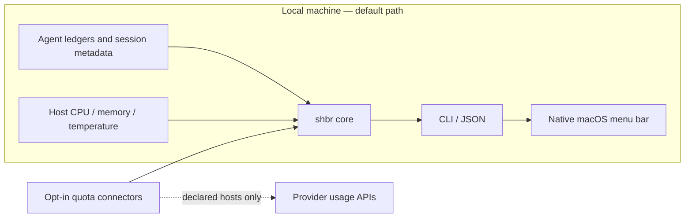

# shbr — SHawn Brain

**A local activity cockpit for the CLI AI agents already running on your machine.**

`shbr` is a thin observer. It does not run your agents, proxy your traffic, or
touch a live database. It reads what your agents already write to disk — usage
snapshots, persistent-memory files, session records — and gives you one place to
see token/quota burn, memory-write activity, and recent sessions across tools.

- **Zero instrumentation.** No SDK to import, no wrapper to launch your agent
  through, no API keys handed over. If a tool already writes state locally,
  `shbr` reads it.
- **Read-only by contract.** Every source is opened read-only (SQLite via
  `mode=ro`, files via stat/glob). `shbr` never writes to a source, only to its
  own append-only event log under `~/.local/state/shbr`.
- **Metadata only.** Token counts, byte deltas, timestamps, model names. Never
  prompt or completion content.
- **Config-driven sources.** Support for a new agent runtime is a small adapter
  plus a few lines of TOML — no core changes.

## Public beta install

```bash
pipx install git+https://github.com/L-SHawn91/shbr.git
shbr doctor
shbr snapshot --no-update
```

For development, clone the repository and run `pip install -e .`. The core is
Python 3.11+ and has no runtime dependencies.

## Use

```bash
shbr snapshot      # everything: usage + memory ops + recent sessions
shbr meter         # token / quota usage per source
shbr memory        # persistent-memory file operations since last scan
shbr sessions      # recent + active sessions
shbr history -n 30 # recent recorded events
shbr config        # show resolved config + which sources are active
shbr doctor        # redaction-safe install + connector trust audit
shbr menubar       # SwiftBar/xbar plugin output (glance line + dropdown)
```

Add `--json` to any command for machine-readable output.

## How it works



No SDK wraps the agent and no proxy sits between the agent and its provider.
Local sources are read-only; `shbr` writes only its own diff baseline, event log,
and connector cache under its configured state directory.

## Menu bar (macOS)

The always-on glance — `🧠 9% · 39° · 53%` (CPU · temp · RAM) — plus a dropdown
with the full meter, per-agent usage/quota, and recent sessions. `shbr` itself
stays a headless, read-only CLI: it only *emits* the data; a separate frontend
draws the menu bar.

**SHawn Brain app (recommended).** A self-contained native menu-bar app — no
third-party host. It shells out to `shbr menubar --json` and renders the panel
itself.

```bash
cd apps/menubar-macos
swift build -c release
.build/release/SHawnBrain          # menu-bar item appears; no dock icon
```

Requires `shbr` on your `PATH`. See [`apps/menubar-macos/README.md`](apps/menubar-macos/README.md)
for the refresh-interval control and packaging notes.

**SwiftBar plugin (dev scaffold).** `shbr menubar` (no `--json`) also prints
[SwiftBar](https://swiftbar.app)/xbar plugin text, handy for a quick check
without building the app:

```bash
brew install swiftbar
mkdir -p ~/.config/swiftbar-plugins
cp contrib/swiftbar/shbr.10s.sh ~/.config/swiftbar-plugins/   # or symlink
```

The filename sets the refresh interval (`shbr.10s.sh` = every 10s). For a
snappier pure-resource meter, rename to `shbr.3s.sh` and use `shbr menubar
--no-agents` (skips the agent-usage query — no subprocess/network call).

## Sources

Out of the box `shbr` auto-discovers only generic, public sources:

| source          | provides                        | activation                          |
|-----------------|---------------------------------|-------------------------------------|
| `usage`         | per-agent token usage, read straight from each local agent's on-disk ledger | on by default; screens all known agents, shows only the active ones |
| `claude_memory` | Claude Code memory-file ops      | on by default                       |
| `system`        | host CPU / memory / temperature  | on by default (stdlib + OS utilities) |

Everything else is opt-in. See [`config.example.toml`](config.example.toml) for
how to point `shbr` at additional runtimes (the shipped example includes a
commented `hermes` adapter for a local SQLite-backed agent).

## Support and trust boundary

Local sources never call the network:

| provider/runtime | local data | activity exposed |
|------------------|------------|------------------|
| Codex | local SQLite ledger | token totals |
| Claude Code | stats cache + recent transcripts | token totals, sessions, memory metadata |
| Gemini CLI | local JSONL sessions | token totals when present |
| OpenCode | local SQLite ledger | token totals |
| Cursor | local SQLite metadata | recent sessions |
| macOS host | OS utilities | CPU, memory, temperature |

Live quota connectors are separate and opt-in:

| connector | trust tier | declared remote hosts |
|-----------|------------|-----------------------|
| Claude | `experimental` | `api.anthropic.com` |
| Codex | `experimental` | `chatgpt.com`, `auth.openai.com` |
| Gemini / Antigravity | `experimental` | `cloudcode-pa.googleapis.com`, `oauth2.googleapis.com` |
| Cursor | `experimental` | `cursor.com` |
| GitHub Copilot | `experimental` | `api.github.com` |
| OpenRouter | `documented` | `openrouter.ai` |
| Ollama Cloud | `experimental` | `ollama.com` |

`documented` means the connector uses a publicly documented provider API.
`experimental` means it relies on an internal, undocumented, or
reverse-engineered endpoint and may stop working without notice. A first-party
hostname alone does not qualify a connector as documented.

## Live Quota Connectors

The default sources never call provider APIs. Live quota connectors are a
separate, opt-in layer for providers that do not keep a complete local usage
ledger.

Connector rules:

- off by default;
- reuse only credentials that the provider's own CLI/app already stored locally;
- never write refreshed credentials back to disk;
- fail silently on network/auth/parse errors;
- return quota metadata only;
- declare every remote hostname and label each endpoint `documented` or
  `experimental`.

Some connectors use POST for a quota query or an in-memory OAuth refresh. They
do not change provider account content, and refreshed tokens are never persisted
by `shbr`. Run `shbr doctor` to see exactly which connectors are enabled and
which hosts they may contact; its output never includes credential values or
prompt content.

This keeps the OSS core useful without forcing users to trust a proxy or hand
over API keys.

## Configuration

`shbr` looks for config in this order: `--config <path>` → `$SHBR_CONFIG` →
`~/.config/shbr/config.toml` → built-in defaults. Your config is merged *over*
the defaults per source, so you only declare what you want to add or change.

## Status

Public beta — local meter, memory metadata, sessions, snapshot, provider controls,
safe diagnostics, and the native macOS viewer.

The current native app is a developer preview: it still expects `shbr` on the
user's `PATH`. The signed, self-contained app is a separate distribution
milestone and is not claimed by this beta.

## License

Apache-2.0.
