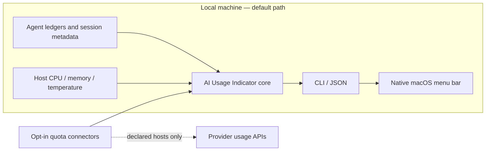

# AI Usage Indicator

**A local multi-account usage monitor for AI providers and agents.**

`ai-usage-indicator` is a thin observer. It does not run your agents, proxy your traffic, or
touch a live database. It reads what your agents already write to disk — usage
snapshots, persistent-memory files, session records — and gives you one place to
see token/quota burn, memory-write activity, and recent sessions across tools.

The legacy `shbr` command and Python module remain compatibility aliases. Existing
`~/.config/shbr`, `~/.local/state/shbr`, and `$SHBR_CONFIG` paths are preserved so
the rename does not discard user state.

### Migrating an existing pipx install

The distribution name changed from `shbr` to `ai-usage-indicator`. A clean pipx
replacement avoids stale package metadata while preserving config and state:

```bash
pipx uninstall shbr
pipx install https://github.com/L-SHawn91/shbr/releases/download/v0.1.0/ai_usage_indicator-0.1.0-py3-none-any.whl
ai-usage-indicator --version
shbr --version                 # compatibility alias, same version
```

Neither command removes `~/.config/shbr` or `~/.local/state/shbr`. New installs
also accept `$AI_USAGE_INDICATOR_CONFIG` and
`~/.config/ai-usage-indicator/config.toml`; canonical paths take precedence, and
legacy paths remain the state-compatible fallback.

Connector cache keys are now account-scoped. Legacy provider-only cache entries
are intentionally not reused; the first enabled connector read after upgrading
refreshes that account's quota cache.

- **Zero instrumentation.** No SDK to import, no wrapper to launch your agent
  through, no API keys handed over. If a tool already writes state locally,
  `shbr` reads it.
- **Read-only by contract.** Every source is opened read-only (SQLite via
  `mode=ro`, files via stat/glob). `shbr` never writes to a source, only to its
  own append-only event log under `~/.local/state/shbr`.
- **Metadata only.** Token counts, byte deltas, timestamps, model names. Never
  prompt or completion content.
- **Config-driven sources.** Support for a new agent runtime is a small adapter
  plus a few lines of TOML — no core changes.

## Public beta install

```bash
pipx install https://github.com/L-SHawn91/shbr/releases/download/v0.1.0/ai_usage_indicator-0.1.0-py3-none-any.whl
ai-usage-indicator doctor
ai-usage-indicator snapshot --no-update
```

For development, clone the repository and run `pip install -e .`. The core is
Python 3.11+ and has no runtime dependencies.

## Use

```bash
ai-usage-indicator snapshot      # everything: usage + memory ops + recent sessions
ai-usage-indicator meter         # token / quota usage per source
ai-usage-indicator memory        # persistent-memory file operations since last scan
ai-usage-indicator sessions      # recent + active sessions
ai-usage-indicator history -n 30 # recent recorded events
ai-usage-indicator config        # resolved config + active sources
ai-usage-indicator doctor        # redaction-safe trust audit
ai-usage-indicator menubar       # menu-bar text or --json contract
```

Add `--json` to any command for machine-readable output.

## How it works



No SDK wraps the agent and no proxy sits between the agent and its provider.
Local sources are read-only; `shbr` writes only its own diff baseline, event log,
and connector cache under its configured state directory.

## Menu bar (macOS)

The always-on glance — `🧠 9% · 39° · 53%` (CPU · temp · RAM) — plus a dropdown
with the full meter, per-agent usage/quota, and recent sessions. `shbr` itself
stays a headless, read-only CLI: it only *emits* the data; a separate frontend
draws the menu bar.

**AI Usage Indicator app (recommended).** A native menu-bar frontend — no
third-party host. The developer preview shells out to `ai-usage-indicator menubar --json` (falling
back to `shbr` during the transition) and renders the panel
itself.

```bash
cd apps/menubar-macos
swift build -c release
.build/release/AIUsageIndicator    # menu-bar item appears; no dock icon
```

Requires `ai-usage-indicator` or legacy `shbr` on your `PATH`. See [`apps/menubar-macos/README.md`](apps/menubar-macos/README.md)
for the refresh-interval control and packaging notes.

**SwiftBar plugin (dev scaffold).** `shbr menubar` (no `--json`) also prints
[SwiftBar](https://swiftbar.app)/xbar plugin text, handy for a quick check
without building the app:

```bash
brew install swiftbar
mkdir -p ~/.config/swiftbar-plugins
cp contrib/swiftbar/shbr.10s.sh ~/.config/swiftbar-plugins/   # or symlink
```

The filename sets the refresh interval (`shbr.10s.sh` = every 10s). For a
snappier pure-resource meter, rename to `shbr.3s.sh` and use `shbr menubar
--no-agents` (skips the agent-usage query — no subprocess/network call).

## Sources

Out of the box `shbr` auto-discovers only generic, public sources:

| source          | provides                        | activation                          |
|-----------------|---------------------------------|-------------------------------------|
| `usage`         | per-agent token usage, read straight from each local agent's on-disk ledger | on by default; screens all known agents, shows only the active ones |
| `claude_memory` | Claude Code memory-file ops      | on by default                       |
| `system`        | host CPU / memory / temperature  | on by default (stdlib + OS utilities) |

Everything else is opt-in. See [`config.example.toml`](config.example.toml) for
how to point `shbr` at additional runtimes (the shipped example includes a
commented `hermes` adapter for a local SQLite-backed agent).

## Support and trust boundary

Local sources never call the network:

| provider/runtime | local data | activity exposed |
|------------------|------------|------------------|
| Codex | local SQLite ledger | token totals |
| Claude Code | stats cache + recent transcripts | token totals, sessions, memory metadata |
| Gemini CLI | local JSONL sessions | token totals when present |
| OpenCode | local SQLite ledger | token totals |
| Cursor | local SQLite metadata | recent sessions |
| macOS host | OS utilities | CPU, memory, temperature |

Live quota connectors are separate and opt-in:

| connector | trust tier | declared remote hosts |
|-----------|------------|-----------------------|
| Claude | `experimental` | `api.anthropic.com` |
| Codex | `experimental` | `chatgpt.com`, `auth.openai.com` |
| Gemini / Antigravity | `experimental` | `cloudcode-pa.googleapis.com`, `oauth2.googleapis.com` |
| Cursor | `experimental` | `cursor.com` |
| GitHub Copilot | `experimental` | `api.github.com` |
| OpenRouter | `documented` | `openrouter.ai` |
| Browser-session pilot | `experimental` | loopback `127.0.0.1` only |

`documented` means the connector uses a publicly documented provider API.
`experimental` means it relies on an internal, undocumented, or
reverse-engineered endpoint and may stop working without notice. A first-party
hostname alone does not qualify a connector as documented.

## Live Quota Connectors

The default sources never call provider APIs. Live quota connectors are a
separate, opt-in layer for providers that do not keep a complete local usage
ledger.

Connector rules:

- off by default;
- reuse only credentials that the provider's own CLI/app already stored locally;
- never write refreshed credentials back to disk;
- fail silently on network/auth/parse errors;
- return quota metadata only;
- declare every remote hostname and label each endpoint `documented` or
  `experimental`.

Some connectors use POST for a quota query or an in-memory OAuth refresh. They
do not change provider account content, and refreshed tokens are never persisted
by `shbr`. Run `shbr doctor` to see exactly which connectors are enabled and
which hosts they may contact; its output never includes credential values or
prompt content.

This keeps the OSS core useful without forcing users to trust a proxy or hand
over API keys.

### Browser-session pilot boundary

The optional `browser_pilot` connector does not read browser cookies, browser
databases, DOM/HTML, local/session storage, or CDP. It accepts only bounded quota
metadata from an account-specific profile through an authenticated
`127.0.0.1` bridge. Redirects, proxies, unknown fields, non-finite values, and
sensitive fields are rejected. The profile must be owned by the current user and
mode `0700`; the local capability-token file must be owned by the current user
and mode `0600`. Because TCP loopback ports can be claimed by another local
process before the trusted helper starts, a port-squatting process could receive
the local bridge capability and spoof quota-display metadata. The capability is
not a provider credential, but users should start the reviewed helper first,
keep its lifetime short, and treat unexpected quota output as untrusted.

This release defines and tests the core-side contract only. It does **not** ship
a provider-specific browser observer and does not perform an unattended login.
Keep `browser_pilot` disabled until a separately reviewed helper implements this
sanitized payload contract.

## Configuration

AI Usage Indicator looks for config in this order: `--config <path>` →
`$AI_USAGE_INDICATOR_CONFIG` →
`~/.config/ai-usage-indicator/config.toml` → `$SHBR_CONFIG` →
`~/.config/shbr/config.toml` → built-in defaults. Your config is merged *over*
the defaults per source, so you only declare what you want to add or change.

## Status

Public beta — local meter, memory metadata, sessions, snapshot, provider controls,
safe diagnostics, and the native macOS viewer.

The current native app is a developer preview: it still expects `shbr` on the
user's `PATH`. The signed, self-contained app is a separate distribution
milestone and is not claimed by this beta.

## License

Apache-2.0.
